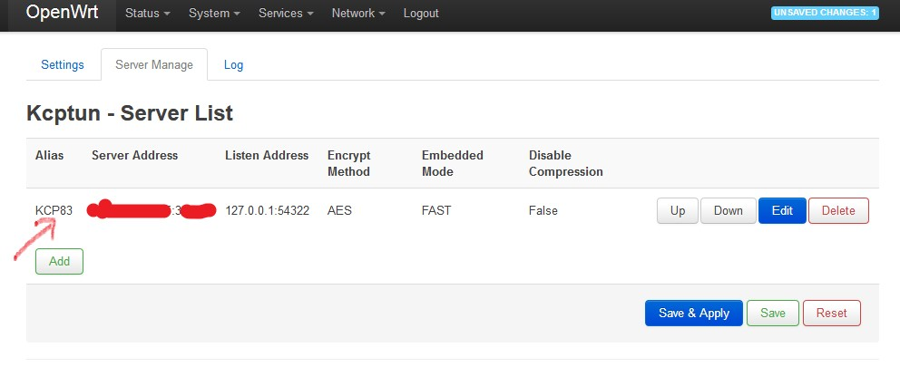
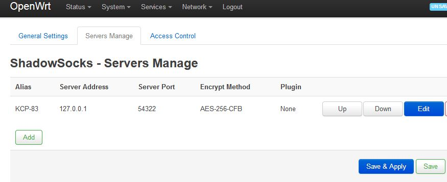
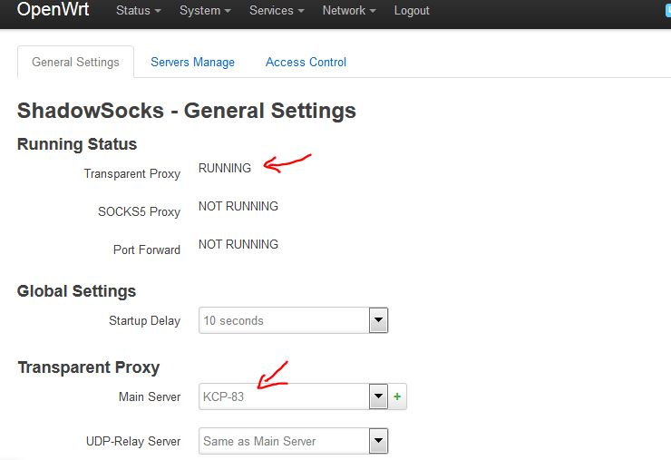

# openwrt-ss-kcp
setup shadowsocks&kcptun on openwrt

# install openwrt in router (you can find device in openwrt.org)

Newifi Y1S < CPU: MT7620A, RAM: 256M >
[Newifi Y1S - install Openwrt with KCPTun& ShadowSocks](https://github.com/boxhg/openwrt-ss-kcp/blob/master/newifi-y1s.md)  

Netgear-WNDR4300 V1 < CPU: Atheros AR9344, RAM: 128M >
[WNDR4300 install OpenWrt 18.06.1 with SS, KCP WNDR4300](https://github.com/boxhg/openwrt-ss-kcp/blob/master/Netgear-WNDR4300-v1.md)

# Shadowsocks & Kcptun Config
1.Services－Kcptun Client 

Server Manage - Add Kcptun Server

    server ip: kcp server ip    
    server port: kcp port
    
    local ip: 127.0.0.1
    local port: xxxxx (any port you like)
    
    
   
Kcptun - Settings   
    
    Server: kcp server
    Client File: /var/kcptun_client   
       
    
2.Service－Shadowsocks config 

ShadowSocks - Servers Manage

    Add SS Server --> Kcp Client

    server: 127.0.0.1   
    port: xxxxx
      
    
ShadowSocks - Access Control

    Zone WAN
    Bypassed IP List : NULL As global proxy
    Forwarded IP:  8.8.8.8    

ShadowSocks - General Settings - 
    
    Transparent Proxy
        choose the ss server config
  

3.Save&Apply, check running status. If SS&KCP not running, check the logs    

# Openwrt Dns Config 

#### 1.Service－DNS-Forwarder 

    Listen Port：5353
    Listen Address：127.0.0.1
    DNS Server：8.8.8.8
    

#### 2.Network－DHCP/DNS

    DNS Forwarder： 127.0.0.1#5353

#### 3.the DNS Query packet trace:

client's dns query -> Router:53 ->  Router:5353 ->8.8.8.8:53

open any website in browser , and router is working..

# Reference URL：

    http://openwrt-dist.sourceforge.net/
    http://openwrt-dist.sourceforge.net/packages/
    http://openwrt-dist.sourceforge.net/archives/  
    
    https://my.oschina.net/CasparLi/blog/487458   
    https://blog.phpgao.com/xiaomi_router_shadowsocks_libev_spec.html
